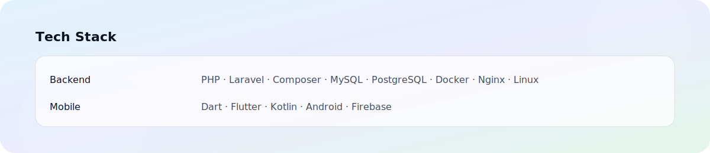

  <picture>
    
  </picture>

   

  <!-- Typing intro (distinct theme) -->
  

  <!-- Quick badges -->
  
  
  

  

### Tentang Saya

Saya seorang profesional yang antusias di bidang IT dengan pengalaman pada dukungan teknis (IT Support) serta pengembangan aplikasi web dan mobile. Saya fokus pada:

- **Stabilitas & Keandalan** dalam operasional sistem dan infrastruktur
- **Pengembangan Web** dengan Laravel (REST API, autentikasi, arsitektur bersih)
- **Pengembangan Mobile** menggunakan Flutter dan Kotlin (UI modern, performa)
- **Kolaborasi** lintas tim dengan dokumentasi yang rapi dan komunikasi efektif

<table>
  <tr>
    <td width="55%" valign="top">

      <h3>Keahlian Utama</h3>
      

        
         
        
      

      

        
        
        
        
      

    </td>
    <td width="45%" valign="top">

      <h3>Profil Singkat</h3>
      

        
        
        
        
      

    </td>

  </tr>
</table>

### Teknologi & Tools

<!-- Stack badges: silakan hapus/ubah sesuai kebutuhan -->

- Backend & Framework:
  - 
    
    
- Mobile:
  - 
    
    
- Database & Infrastruktur:
  - 
    
    
    
    
    
- Kolaborasi & Produktivitas:
  - 
    
    
    
    
    
    

<!-- Visual stacks via skillicons (distinct vs reference repo by arrangement/colors) -->

  
   
  

  

  

### Sorotan Pengalaman

- Menangani insiden dan permintaan IT harian dengan prioritas dan SLA yang jelas
- Membangun backend API Laravel dengan autentikasi, otorisasi, dan dokumentasi
- Mengembangkan aplikasi mobile Flutter/Kotlin dengan arsitektur yang terstruktur
- Menyusun pipeline sederhana untuk build/test, serta praktik code review yang sehat

### Fokus & Pembelajaran Saat Ini

- Backend Reliability
   
  <meter min="0" max="100" value="80">80%</meter> 80% — observability, queue, retry, graceful shutdown

- Flutter Performance
   
  <meter min="0" max="100" value="70">70%</meter> 70% — state mgmt, lazy lists, image caching

- Kotlin/Android
   
  <meter min="0" max="100" value="60">60%</meter> 60% — Jetpack components, clean arch modules

  

### Portofolio Pilihan

<!-- Ganti link/teks di bawah dengan proyek nyata Anda -->

  
  
  

<b>Detail Teknis Tambahan</b>

- Pola arsitektur: clean-ish architecture, separation of concerns, reusable components
- Praktik: commit message konvensional, dokumentasi API, environment management
- Performa: query optimization, lazy loading, caching sederhana

### Hubungi Saya

Silakan sesuaikan tautan di bawah ini sesuai preferensi Anda.

- Email: [tulis email Anda di sini]
- LinkedIn: [tautan LinkedIn]
- Website/Blog: [tautan personal bila ada]

---

Terima kasih sudah berkunjung! Jika Anda tertarik berkolaborasi atau berdiskusi, jangan ragu untuk menghubungi saya. 🙌

### Kartu & Statistik GitHub

Ganti `afahzis14` di bawah ini dengan username GitHub Anda agar kartu aktif.

  
  

  

  

    

  <!-- Activity graph (distinct visual) -->
  

   

  

### Proyek yang Disorot (Pinned)

Ganti `afahzis14` dan `hush_laravel` dengan proyek Anda.

  
  

### CTA

  
  
  

### Terhubung dengan Saya

  
  
  
  

### Aktivitas Terbaru

<!-- Anda bisa mengotomasi bagian ini dengan GitHub Actions (opsional) -->

- ✨ Fokus: backend API yang andal dan aplikasi mobile performa tinggi
- 🔧 Saat ini: menata struktur proyek agar mudah di-scale dan di-maintain
- 📚 Pembelajaran: praktik arsitektur modular, CI/CD ringan, dan observability

  

  Terinspirasi dari profil modern namun dengan gaya visual berbeda, memprioritaskan keterbacaan dan tema glass‑neon yang bersih.

