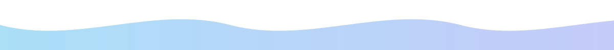
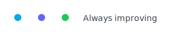
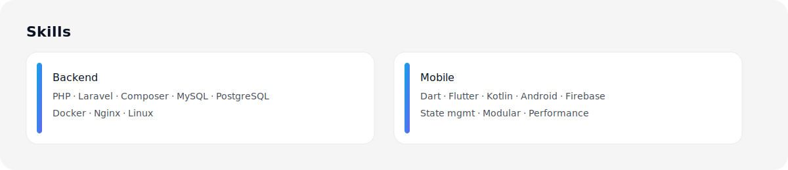
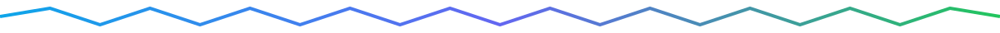
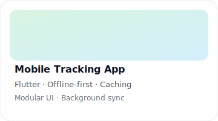
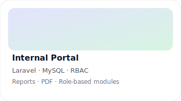

  <picture>
    
  </picture>

   

  

   

  
  
  

  

  
  
  

  

### Tentang Saya
Saya seorang profesional di bidang IT dengan pengalaman IT Support dan pengembangan aplikasi web/mobile. Fokus pada reliability, arsitektur bersih, dan kolaborasi efektif.

  
  
  

### Ringkasan Visual

<table>
  <tr>
    <td width="55%" valign="top">

      <h3>Keahlian Utama</h3>
      

        
         
        
      

      

        
        
        
        
      

    </td>
    <td width="45%" valign="top">

      <h3>Profil Singkat</h3>
      

        
        
        
        
      

    </td>
  </tr>
</table>

### Teknologi & Layanan

  

  

### Sorotan Pengalaman
- Menangani insiden IT harian dengan prioritas dan SLA yang jelas
- Membangun backend API Laravel dengan autentikasi, otorisasi, dan dokumentasi
- Mengembangkan aplikasi mobile Flutter/Kotlin dengan arsitektur modular
- Menyusun pipeline sederhana untuk build/test, serta praktik code review

### Fokus & Pembelajaran Saat Ini

- Backend Reliability
   
  ▰▰▰▰▰▰▰▰▱▱ 80% — observability, queue, retry, graceful shutdown

- Flutter Performance
   
  ▰▰▰▰▰▰▰▱▱▱ 70% — state mgmt, lazy lists, image caching

- Kotlin/Android
   
  ▰▰▰▰▰▰▱▱▱▱ 60% — Jetpack components, clean arch modules

  

### Portofolio Pilihan

  
  
  

<b>Detail Teknis Tambahan</b>

- Pola arsitektur: clean-ish architecture, separation of concerns, reusable components
- Praktik: commit message konvensional, dokumentasi API, environment management
- Performa: query optimization, lazy loading, caching sederhana

### Kartu & Statistik GitHub

  
  

    

  

    

  

   

  

### CTA

  
  
  

### Terhubung dengan Saya

  
  
  
  

### Aktivitas Terbaru

- ✨ Fokus: backend API yang andal dan aplikasi mobile performa tinggi
- 🔧 Saat ini: menata struktur proyek agar mudah di-scale dan di-maintain
- 📚 Pembelajaran: praktik arsitektur modular, CI/CD ringan, dan observability

  

  
 

  Terinspirasi dari profil modern, namun dengan gaya visual berbeda yang menekankan keterbacaan dan nuansa glass‑neon.

  

